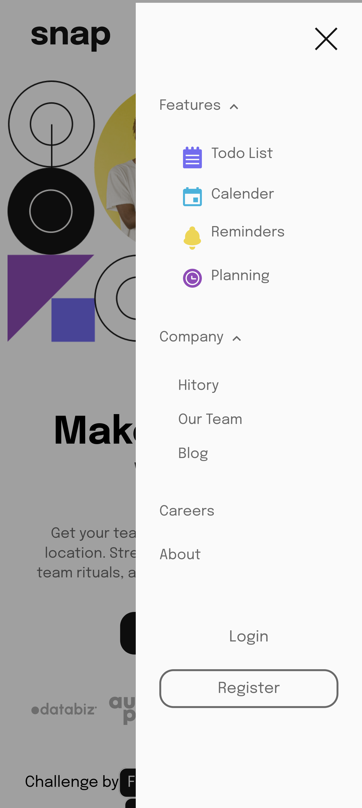

# Frontend Mentor - Intro section with dropdown navigation solution

This is a solution to the [Intro section with dropdown navigation challenge on Frontend Mentor](https://www.frontendmentor.io/challenges/intro-section-with-dropdown-navigation-ryaPetHE5). Frontend Mentor challenges help you improve your coding skills by building realistic projects. 

## Table of contents

- [Overview](#overview)
  - [The challenge](#the-challenge)
  - [Screenshot](#screenshot)
  - [Links](#links)
- [My process](#my-process)
  - [Built with](#built-with)
  - [What I learned](#what-i-learned)
  - [Useful resources](#useful-resources)
- [Author](#author)
- [Acknowledgments](#acknowledgments)

## Overview

### The challenge

Users should be able to:

- View the relevant dropdown menus on desktop and mobile when interacting with the navigation links
- View the optimal layout for the content depending on their device's screen size
- See hover states for all interactive elements on the page

### Screenshot
For Mobile

For Desktop 

### Links

- Live Site URL: [live site URL ](https://ali007-depug/intro-section-with-dropdown-menu)

## My process

### Built with

- Semantic HTML5 markup
- CSS custom properties
- Flexbox
- CSS Grid
- Mobile-first workflow
### What I learned
1. using subgrid in grid childern.
2. using @use & @forward rules in sass instead of @import rule
3. using BEM archticutre

### Useful resources

- [jessic chan news homepage solution repo ](https://www.example.com) - This helped me for using BEM.

## Author

- LinkeIn- [Ali AbdElbagi](https://www.linkein.com/in/ali-abdelbagi-0231b223)
- Frontend Mentor - [Ali AbdElbagi](https://www.frontendmentor.io/profile/ali007-depug)

## Acknowledgments
Thank to Jessica chan and her channel on youtube CoderCoder.